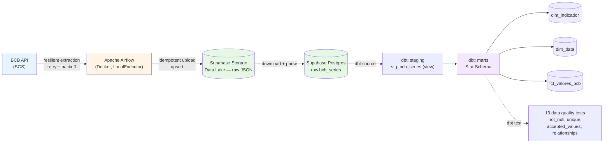
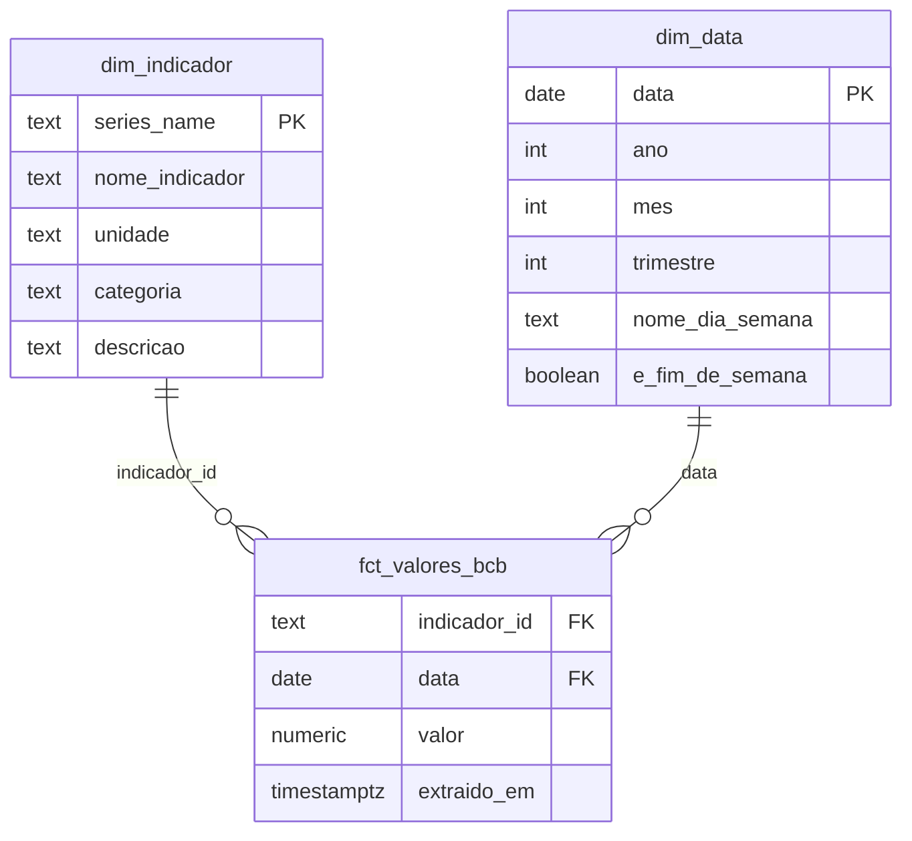

# BCB ELT Pipeline

An end-to-end data engineering pipeline, built from scratch, that extracts public economic indicators from the Central Bank of Brazil (BCB), orchestrates the cloud load via Apache Airflow, and transforms the data into a dimensional model (star schema) tested with dbt.

Portfolio project built at a ~1h/day pace, with a deliberate focus on data engineering best practices: fault tolerance, idempotency, tested data quality, and secure credential handling — not just "making it work."

---

## Architecture



**Summary flow:** `Public API → Airflow (orchestration) → Data Lake (raw) → Data Warehouse raw layer → dbt (staging → marts) → data quality tests`, all triggered by a single daily DAG.

---

## Tech stack

| Layer | Technology | Why |
|---|---|---|
| Extraction | Python (`requests`), exponential backoff retry | Resilience against transient network/API failures |
| Orchestration | Apache Airflow 2.10.2 (Docker, LocalExecutor) | Industry-standard for scheduled, observable pipelines |
| Data Lake | Supabase Storage (private bucket) | Immutable raw storage, a safety net against transformation bugs |
| Data Warehouse | Supabase Postgres | Modern ELT: transformation happens inside the warehouse, not in an external tool |
| Transformation | dbt (`dbt-postgres`) | Versioned, tested, and documented SQL; dimensional modeling |
| Containerization | Docker + Docker Compose | Reproducible environment, independent of the host machine |

> **Note on the cloud provider choice:** the project originally targeted GCP (BigQuery + Cloud Storage), but all three major providers (AWS, GCP, Azure) require a credit card even on their free tiers. I chose Supabase instead — managed Postgres + Storage, no card required — which also simplified the architecture by unifying the Data Lake and Data Warehouse under a single provider.

---

## Data model (Star Schema)



- **`dim_indicador`**: static metadata for each series (dbt seed) — USD PTAX rate, Selic rate, IPCA inflation index.
- **`dim_data`**: calendar dimension generated via `generate_series`, covering the actual date range present in the data.
- **`fct_valores_bcb`**: fact table — one value per indicator per date.
- Referential integrity between fact and dimensions is validated by dbt `relationships` tests (Postgres itself has no formal FKs across dbt-managed schemas here).

---

## Project structure

```
bcb-elt-pipeline
├── dags/                       # Airflow DAGs
├── src/
│   ├── extractors/              # BCB API extraction (retry, backfill, incremental)
│   ├── loaders/                 # Storage upload/download + Postgres raw load
│   └── utils/                   # Centralized logger
├── dbt_project/
│   ├── models/
│   │   ├── staging/              # Light cleaning, near 1:1 with raw
│   │   └── marts/                # Star schema (dim/fct)
│   └── seeds/                    # Static reference data
├── docker/
│   ├── docker-compose.yaml       # Airflow + local Postgres + volumes
│   ├── Dockerfile                # Custom Airflow image (+ dbt)
│   └── dbt_profiles/             # Safe profiles.yml (credentials via env_var())
├── data/raw/                    # Local extraction cache (incremental/backfill)
└── requirements*.txt            # Dependencies split by environment (see note below)
```

### Why are there multiple `requirements*.txt` files?

The project runs across **three different Python environments**, each with its own constraints:

| File | Environment | Python |
|---|---|---|
| `requirements.txt` | Local `.venv` (extraction/loading) | 3.14 |
| `requirements-dbt.txt` | Local `.venv-dbt` (dbt outside Airflow) | 3.12 |
| `docker/requirements-airflow.txt` | Inside the Airflow container | 3.11 |

This wasn't an initial design choice — it was a consequence of running on a very recent Python 3.14, whose ecosystem (`dbt-core`, `dbt-postgres`) didn't yet have full official support at the time this was built. See the lessons-learned section below.

---

## Running it locally

**Prerequisites:** Docker Desktop, Python 3.11+ (ideally a version with full dbt ecosystem support), a Supabase account (free tier).

```bash
# 1. Clone and set up the environment
git clone <repo-url>
cd bcb-elt-pipeline-gcp
python -m venv .venv && .venv\Scripts\activate
pip install -r requirements.txt

# 2. Configure credentials (see .env.example)
cp .env.example docker/.env
# fill in with real Supabase credentials

# 3. Start Airflow
cd docker
docker compose up -d --build

# 4. Go to http://localhost:8080 (airflow/airflow)
#    Register the 'supabase_postgres' Connection under Admin > Connections
#    Create the 'bcb_ultimos_n' Variable = 20 under Admin > Variables

# 5. Trigger the 'bcb_extracao_incremental' DAG manually
```

Full local dbt setup details (separate environment) are documented as comments in `requirements-dbt.txt`.

---

## Design principles applied

- **Idempotency at every layer**: date-partitioned extraction, upsert-based uploads, Postgres loads via `ON CONFLICT`, full-refresh marts — running the pipeline twice on the same day never duplicates data (validated in practice).
- **Two-layer resilience**: exponential backoff retry in code (fast/transient failures) + Airflow-level retries, more spaced out (larger outages) — sized deliberately so they don't needlessly overlap.
- **Configuration without redeploys**: operational parameters (`ultimos_n`) via Airflow Variables, never hardcoded.
- **Secrets never in code**: the Fernet key, Supabase credentials, and the dbt `profiles.yml` all use environment variables / `env_var()` — never hardcoded. Even the containerized copy of `profiles.yml` is git-safe by design.
- **Deliberately "dumb" raw layer**: schema nearly 1:1 with the API, no business logic — the raw layer is the safety net that allows transformations to be reprocessed without re-extracting from the source.
- **Data tests as an automatic safety net**: 13 dbt tests covering required fields, accepted values, and fact↔dimension referential integrity.

---

## Lessons learned (real debugging)

These were genuine problems encountered and solved while building this — documented here because real debugging is where the real learning happens:

- **The BCB API rejects requests with no date range** (406) and caps `ultimos/{N}` at 20 records (400) — discovered by testing against the live API, not from documentation.
- **Airflow's PATH is configured via its entrypoint script, not `ENV`** — overriding the `entrypoint` in Docker Compose (needed to customize `airflow-init`) silently breaks resolution of commands like `airflow`.
- **Airflow ships an official "constraints file"** pinning compatible versions of its own dependencies — manually pinning different versions in `requirements-airflow.txt` causes dependency resolution conflicts; leaving them unpinned and trusting the constraints file is the correct approach.
- **`PythonOperator` auto-serializes its return value via XCom** — returning a `pathlib.Path` breaks the task with a `TypeError` *after* the real work has already succeeded. Fixed by returning `str()` and disabling XCom push where the value isn't consumed downstream.
- **dbt had no official Python 3.14 support** at the time of building (only from dbt-core 1.12 onward, with no matching `dbt-postgres` build published yet) — solved with a dedicated virtual environment (Python 3.12) for local use, and by installing dbt directly inside the Airflow container (Python 3.11) for orchestrated runs.
- **YAML is fragile to manual editing**: accented characters breaking encoding, incorrect indentation (`volumes:` nested inside `environment:` instead of as a sibling), and colons inside unquoted strings — all caused parsing failures only detectable by running `docker compose config`.

---

## Project status

Complete, end-to-end validated pipeline. Possible next steps: a consumption dashboard on top of the marts, CI for the dbt tests, deployment to a managed cloud Airflow environment.